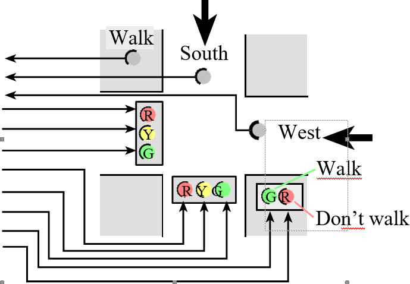

**CECS 346 Project 1**

**Traffic Light Controller with Moore FSM**

© 2026 Dr. Min He, CSULB. All rights reserved.

# **Overview**

Design and build a traffic light controller for a 4-corner intersection
of two one-way streets (South and West) with a pedestrian crossing. Your
system uses a Moore FSM with SysTick timer to coordinate three
participants: South traffic, West traffic, and pedestrians. This project
integrates all skills from Labs 1–4: GPIO initialization, FSM design,
struct-based state tables, SysTick timing, and hardware interfacing.

## **Learning Objectives**

- Design a Moore FSM with 9 states, 3 inputs (8 combinations), and
  multiple outputs

- Implement the FSM using an indexed data structure (struct array) in C

- Use SysTick timer for all timing delays (no software delay loops)

- Interface multiple GPIO ports: Port B (traffic LEDs), Port E
  (sensors), Port F (pedestrian LEDs)

- Use bit-specific addressing for all I/O access

- Build and debug a multi-port embedded system on a breadboard

- Apply round-robin fairness scheduling for competing intersection
  participants

## **Preparation**

**Complete before starting:**

- Read textbook Sections 6.4–6.9

- Review reference projects: SimpleTrafficLight, SysTick

- Have a working Lab 4 project (starter project for this project)

**Materials needed:**

- TM4C123 LaunchPad

- 6 LEDs: 2 red, 2 yellow, 2 green (for South and West traffic lights)

- 3 switches: preferably slide switches or DIP switches (not momentary
  push buttons)

- Resistors for LED current limiting (330Ω–1kΩ)

- Breadboard and jumper wires

*Note: Slide switches or DIP switches are strongly preferred because
sensors must remain ON until the FSM reads them. Push buttons require
holding throughout the entire state duration.*

# **System Requirements**

Design a traffic light controller for the intersection of two equally
busy one-way streets. The goal is to maximize traffic flow, minimize
waiting time, and avoid accidents.

Figure 1: 4-corner intersection with South, West, and Pedestrian
participants

## **Three Participants**

|                 |                   |                              |                              |
|-----------------|-------------------|------------------------------|------------------------------|
| **Participant** | **Sensor**        | **Green Lights**             | **Logic**                    |
| South           | PE2 — car sensor  | PB0 (G), PB1 (Y), PB2 (R)    | Positive: 3.3V = car present |
| West            | PE1 — car sensor  | PB3 (G), PB4 (Y), PB5 (R)    | Positive: 3.3V = car present |
| Pedestrian      | PE0 — walk button | PF3 (walk), PF1 (don't walk) | Positive: 3.3V = ped waiting |

## **Pedestrian Light Sequence**

|            |                   |              |                           |
|------------|-------------------|--------------|---------------------------|
| **Phase**  | **LED**           | **Duration** | **Meaning**               |
| Walk       | PF3 green ON      | 2 sec        | Pedestrians may cross     |
| Hurry Up   | PF1 red FLASHING  | 1 sec total  | Finish crossing quickly   |
| Don't Walk | PF1 red ON steady | —            | Do not enter intersection |

*Hurry Up flashing: 0.25s on, 0.25s off, 0.25s on, 0.25s off = 1 second
total (4 states).*

## **Timing Summary**

|                |                       |
|----------------|-----------------------|
| **Phase**      | **Duration**          |
| Green / Walk   | 2 seconds (8 × 0.25s) |
| Yellow / Hurry | 1 second (4 × 0.25s)  |

**Base time unit: 0.25 seconds. Use SysTick timer (not software delay
loops).**

# **Fairness Rules (Round-Robin Scheduling)**

When multiple participants need the intersection, service them fairly
using these rules:

**Rule 1:** Traffic lights must follow green → yellow → red. No other
transition is allowed.

**Rule 2:** Pedestrian lights must follow walk → hurry → don't walk. No
other sequence is allowed.

**Rule 3:** Once a participant starts a green-yellow-red (or
walk-hurry-don't walk) transition, it must complete the full sequence
before giving green to another participant.

**Rule 4:** When two participants compete for green after a transition,
neither may be the one that just had green. Alternate fairly between the
two competitors.

*Example (Rule 4): After GoS (South had green), if both West and
Pedestrian need green, assign one in case 1 (all three competing) and
the other in case 2 (only two competing). This ensures fair
alternation.*

**The system starts with Green on South.**

# **Implementation Requirements**

**⚠ No conditional branches (if-else) in the FSM engine. No \#include
tm4c123gh6pm.h — you must define all registers yourself.**

- Implement a Moore FSM: each state has a name, output, wait time, and 8
  next states

- Use SysTick timer for all delays

- Use bit-specific addressing for P_LIGHTS, T_LIGHTS, and SENSORS

- Do not embed functionality (e.g., flash twice) into the engine that is
  not in the state graph

## **GPIO Pin Assignments**

|                   |         |
|-------------------|---------|
| **Traffic Light** | **Pin** |
| Green south       | PB0     |
| Yellow south      | PB1     |
| Red south         | PB2     |
| Green west        | PB3     |
| Yellow west       | PB4     |
| Red west          | PB5     |

|                        |         |
|------------------------|---------|
| **Sensor / Button**    | **Pin** |
| South car sensor       | PE2     |
| West car sensor        | PE1     |
| Pedestrian Walk        | PE0     |
| Walk light (green)     | PF3     |
| Don't Walk light (red) | PF1     |

## **Required Bit-Specific Address Definitions**

> \#define P_LIGHTS (\*(volatile uint32_t \*)0x\_\_\_\_\_\_\_\_\_) //
> PF3, PF1
>
> \#define T_LIGHTS (\*(volatile uint32_t \*)0x\_\_\_\_\_\_\_\_\_) //
> PB5-PB0
>
> \#define SENSORS (\*(volatile uint32_t \*)0x\_\_\_\_\_\_\_\_\_) //
> PE2-PE0

*You must calculate these addresses using base + (bit_mask \<\< 2).*

# **FSM Design**

## **State List (9 states)**

|           |                   |                  |           |                                    |
|-----------|-------------------|------------------|-----------|------------------------------------|
| **State** | **Time (×0.25s)** | **PB5-0 Output** | **PF3,1** | **Description**                    |
| GoS       | 8                 | 100001           | 01        | South green, West red, Don't walk  |
| WaitS     | 4                 | (fill in)        | (fill in) | South yellow, West red, Don't walk |
| GoW       | 8                 | (fill in)        | (fill in) | South red, West green, Don't walk  |
| WaitW     | 4                 | (fill in)        | (fill in) | South red, West yellow, Don't walk |
| GoP       | 8                 | (fill in)        | (fill in) | Both red, Walk (green on)          |
| WaitPOn1  | 1                 | (fill in)        | (fill in) | Both red, Hurry flash ON (1st)     |
| WaitPOff1 | 1                 | (fill in)        | (fill in) | Both red, Hurry flash OFF (1st)    |
| WaitPOn2  | 1                 | (fill in)        | (fill in) | Both red, Hurry flash ON (2nd)     |
| WaitPOff2 | 1                 | (fill in)        | (fill in) | Both red, Hurry flash OFF (2nd)    |

## **State Transition Table (you complete this)**

Input order: PE2 (South), PE1 (West), PE0 (Pedestrian) → 3 bits → 8
combinations (000–111).

Partially filled — complete the remaining cells using the fairness
rules:

|               |           |           |           |           |           |           |           |           |
|---------------|-----------|-----------|-----------|-----------|-----------|-----------|-----------|-----------|
| **State**     | **000**   | **001**   | **010**   | **011**   | **100**   | **101**   | **110**   | **111**   |
| **GoS**       | GoS       | WaitS     | WaitS     | WaitS     | GoS       | WaitS     | WaitS     | WaitS     |
| **WaitS**     | GoW       | GoP       | GoW       | GoW       | GoP       | GoP       | GoW       | GoP       |
| **GoW**       |           |           |           |           |           |           |           |           |
| **WaitW**     |           |           |           |           |           |           |           |           |
| **GoP**       | GoP       | GoP       | WaitPOn1  |           |           |           |           |           |
| **WaitPOn1**  | WaitPOff1 | WaitPOff1 | WaitPOff1 | WaitPOff1 | WaitPOff1 | WaitPOff1 | WaitPOff1 | WaitPOff1 |
| **WaitPOff1** | WaitPOn2  | WaitPOn2  | WaitPOn2  | WaitPOn2  | WaitPOn2  | WaitPOn2  | WaitPOn2  | WaitPOn2  |
| **WaitPOn2**  | WaitPOff2 | WaitPOff2 | WaitPOff2 | WaitPOff2 | WaitPOff2 | WaitPOff2 | WaitPOff2 | WaitPOff2 |
| **WaitPOff2** |           |           |           |           |           |           |           |           |

# **Implementation Steps**

**Step 1:** Design the FSM. Draw the state diagram showing all 9 states,
outputs, wait times, and transitions. Complete the state table above.

**Step 2:** Write and debug in Keil simulator. Use the Logic Analyzer to
verify all input/output combinations.

**Step 3:** Build the switch circuits (positive logic). Wire 3 switches
to PE2, PE1, PE0. Test with a simple program that maps each switch to an
onboard LED.

**Step 4:** Build the LED circuits (positive logic). Wire 6 LEDs to
PB5–PB0 arranged like a traffic intersection. Test with a program that
turns all LEDs on then off.

**Step 5:** Integrate and debug the complete system on the LaunchPad.

**⚠ Do not place or remove wires on the breadboard while power is on.**

# **Onboard Demonstration Steps**

Follow this sequence for the live demo:

**1. Reset:** South green on, West red, Pedestrian don't walk (red
steady).

**2. Single participant tests:**

- Turn on West sensor → observe South green→yellow→red, then West green

- Turn on Pedestrian → observe West green→yellow→red, then Walk green

- Turn on South → observe Walk→Hurry→Don't Walk, then South green

- Turn on Pedestrian → Walk sequence, then back to another participant

- Turn on West → transition to West green

- Turn on South → transition to South green

**3. Two participant tests (observe two full rounds):**

- South + Pedestrian: hold both, watch alternating service

- South + West: hold both, watch alternating service

- West + Pedestrian: hold both, watch alternating service

**4. Three participant test:** Hold all three, observe two full rounds
of round-robin cycling.

# **Deliverables and Grading**

|        |                                                                                   |                |            |         |
|--------|-----------------------------------------------------------------------------------|----------------|------------|---------|
| **\#** | **Item**                                                                          | **Format**     | **Points** | **Due** |
| 1      | On-board demonstration (all test cases). All team members present.                | Live demo      | 30         | In lab  |
| 2      | Logic Analyzer simulation screenshots (test case 4: all three participants)       | In report      | 10         | Report  |
| 3      | Video or link for on-board demo (all test cases)                                  | Link in report | 10         | Report  |
| 4      | Source code (.c/.h files). No startup.s, no tm4c123gh6pm.h. Define all registers. | Separate files | 20         | Report  |
| 5      | Project report (see format below)                                                 | Word or PDF    | 30         | Report  |

## **Project Report Format**

**Hardware Design:** Professional schematic and photo of your embedded
system.

**Operation:** Include the video link for on-board demonstration.

**Software Design:** State table, state diagram, and list of .c/.h
source files.

**Conclusion:** Challenges, how you solved them, and what you learned
most from this project.
